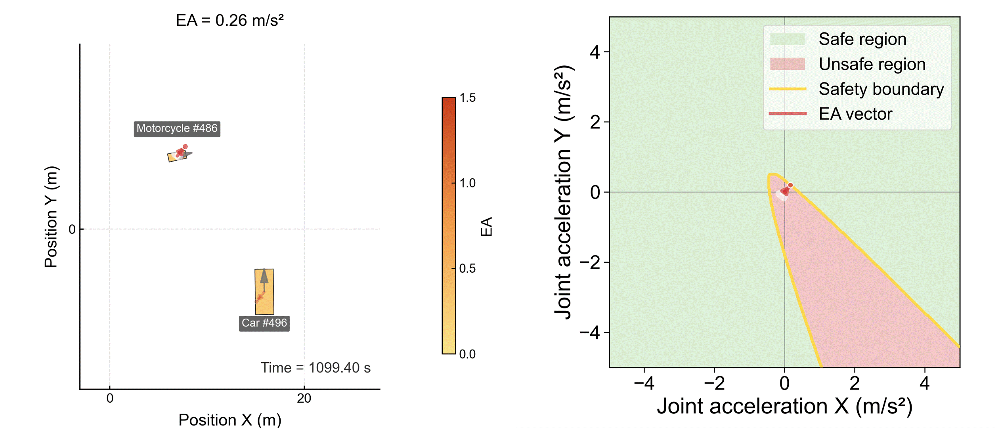
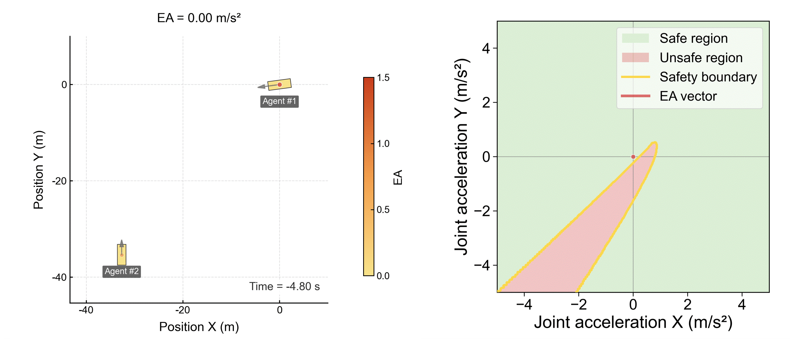

# Evasive Acceleration (EA)

A two-dimensional paradigm for instantaneous driving risk quantification.

---

## Visual Overview

### Naturalistic Interactions

<p align="center">
  
</p>

A representative high-risk intersection interaction from the SIND dataset, involving one vehicle and one motorcycle.  
**The EA value is the magnitude of the red arrow shown in the visualization. A longer red arrow indicates a higher instantaneous risk level.**

### Reconstructed Crash Cases

<p align="center">
  
</p>

A T-bone collision case from the CIMSS-TA database.   
**The EA value is the magnitude of the red arrow shown in the visualization. A longer red arrow indicates a higher instantaneous risk level.**

---

## Overview

Evasive Acceleration (EA) quantifies driving risk as the minimum constant relative acceleration required to make a predicted interaction collision-free. Unlike time-to-collision (TTC)-based methods, EA evaluates risk in a two-dimensional joint-motion space rather than through one-dimensional temporal proximity alone.

This repository provides an implementation of EA for two practical use cases:

1. **Single-frame computation**  
   For real-time or instant-evaluation scenarios, such as online risk monitoring, reinforcement learning, and other applications that need the EA value of the current frame immediately.

2. **Batch computation**  
   For offline processing of trajectory datasets, where EA and baseline metrics are computed frame by frame from CSV files.

In addition to EA, the repository also includes a set of baseline risk metrics for comparison, as well as visualization utilities for rendering interaction cases as GIFs.

---

## Why EA?

Most existing risk metrics in autonomous driving are built around the TTC paradigm. These methods quantify risk mainly through a single temporal dimension, even though real traffic interactions are inherently two-dimensional and directional.

This mismatch can lead to two common issues:

- interactions with substantially different avoidance difficulty may receive similar TTC-like values;
- risk may appear to keep increasing even after an effective evasive manoeuvre has already started resolving the conflict.

EA addresses this by measuring the minimum instantaneous intervention required to make the interaction collision-free. It reframes risk as the physical effort needed to restore safety, rather than as time remaining under nominal motion.

---

## Repository Structure

```text
evasive-acceleration/
├── README.md
├── LICENSE
├── .gitignore
├── assets/
│   └── gifs/
├── demo_data/
├── src/
│   ├── core_ea.py
│   ├── baseline_risk_metrics.py
│   ├── single_frame.py
│   └── batch_compute.py
└── visualization/
```

### Main Components

#### `src/core_ea.py`

Core implementation of EA. This file contains the main EA solver, the four motion-mode evaluations, and the final aggregated EA computation.

#### `src/baseline_risk_metrics.py`

Baseline risk metrics used for comparison, such as TTC, TTC2D, ACT, DRAC, MEI, and related quantities.

#### `src/single_frame.py`

Entry script for single-frame EA computation. This is the recommended starting point for users who want to compute EA directly from the current instantaneous states of two road users.

#### `src/batch_compute.py`

Entry script for batch computation on CSV files. This is used to process trajectory datasets frame by frame and write the computed results back to output files.

#### `demo_data/`

Example data for quick testing.

#### `visualization/`

Visualization scripts for rendering trajectory cases and exporting GIFs.

#### `assets/gifs/`

GIFs displayed in this README.

---

## Input Definition

EA is computed from the instantaneous states of two road users.

Each road user is represented by **7 parameters**.

### Required 7 Parameters for Each Road User

For road user \( i \in \{A, B\} \), the input is:

```text
(x_i, y_i, v_i, h_i, L_i, W_i, ω_i)
```

where:

- `x_i`: global x position `[m]`
- `y_i`: global y position `[m]`
- `v_i`: speed magnitude `[m/s]`
- `h_i`: heading angle `[rad]`
- `L_i`: body length `[m]`
- `W_i`: body width `[m]`
- `ω_i`: yaw rate `[rad/s]`

So one interaction frame consists of **14 values in total**.

### Command-Line Order

In this repository, the order for each road user is always:

```text
x y speed heading length width yaw_rate
```

---

## Notes on Yaw Rate Input

Some trajectory datasets do not provide yaw rate directly. In that case, users can estimate yaw rate from the historical heading sequence by a simple finite-difference step. In practice, a small amount of smoothing or filtering is recommended to reduce numerical jitter.

### Recommended Guidance

- If both interacting road users do not exhibit noticeable turning behaviour, you may directly set:

```text
yaw_rate = 0
```

In such cases, the impact on EA is usually negligible.

- If either road user is clearly turning, it is recommended to provide a more accurate yaw-rate input for EA computation.

This is especially important when the interaction geometry is strongly influenced by rotation.

---

## Applicability to Vulnerable Road Users

The method is not limited to cars. It can also be applied directly to vulnerable road users (VRUs) such as:

- cyclists
- pedestrians

The input format remains exactly the same. The main difference is simply that the body dimensions are smaller, so the corresponding length and width values should reflect the physical size of the target road user.

---

## Usage

### 1. Single-Frame Computation

Use `src/single_frame.py` when you want the EA value of the current frame only.

This mode is suitable for:

- online risk monitoring
- reinforcement learning
- real-time evaluation
- instant inspection of one interaction state

#### 1.1 Run the Built-In Example

```bash
python src/single_frame.py
```

This runs the built-in example case in `single_frame.py` and prints:

```text
EA = ...
Runtime = ...
```

#### 1.2 Run With Your Own Input

```bash
python src/single_frame.py \
  --agent-a 0 0 10 0 4.5 1.8 0 \
  --agent-b 20 0 8 3.1415926 4.7 1.9 0
```

The order for each road user is:

```text
x y speed heading length width yaw_rate
```

#### 1.3 Meaning of the Example Above

For agent A:

- position = `(0, 0)` m
- speed = `10` m/s
- heading = `0` rad
- size = `4.5 × 1.8` m
- yaw rate = `0` rad/s

For agent B:

- position = `(20, 0)` m
- speed = `8` m/s
- heading = `π` rad
- size = `4.7 × 1.9` m
- yaw rate = `0` rad/s

#### 1.4 Output

The terminal output is intentionally minimal:

```text
EA = ...
Runtime = ...
```

---

### 2. Batch Computation

Use `src/batch_compute.py` when you want to process a CSV file or a set of trajectory cases frame by frame.

This mode is suitable for:

- offline trajectory-dataset analysis
- frame-wise processing over many files
- comparison between EA and baseline metrics
- exporting computed results for further study

#### 2.1 Run Batch Computation

```bash
python src/batch_compute.py
```

#### 2.2 Typical Workflow

1. Prepare the input CSV files.
2. Place them in `demo_data/` or another target directory.
3. Check the input/output path settings in `src/batch_compute.py`.
4. Run the script.
5. Inspect the generated output CSV files.

#### 2.3 Important Note

Batch-processing workflows are often dataset-specific. Before applying the script to a new dataset, please check:

- file path settings
- file-selection logic
- expected input column names
- output file naming logic

inside `src/batch_compute.py`.

---

### 3. Visualization

Use the scripts in `visualization/` to render interaction cases and export GIFs.

These utilities are intended for:

- qualitative inspection of interaction geometry
- visualization of risk evolution over time
- generation of GIF assets for analysis or presentation

#### Typical Workflow

1. Prepare the corresponding CSV case.
2. Run the target visualization script in `visualization/`.
3. Inspect the generated images or GIFs.

The visualizations are kept separate from the solver so that users interested only in computation do not need the plotting workflow.

---

## What the Code Computes

### EA

The final EA value is computed as the arithmetic mean of four motion-mode-specific values:

- `EA_CTCT`
- `EA_CTCV`
- `EA_CVCT`
- `EA_CVCV`

These correspond to different short-horizon nominal motion assumptions.

### Baseline Metrics

The repository also includes several baseline risk metrics for comparison, such as:

- `TTC`
- `TTC2D`
- `ACT`
- `DRAC`
- `MEI`

These are implemented separately from the EA core solver.

---

## Recommended Usage by Scenario

Use `single_frame.py` if you need:

- real-time EA evaluation
- online risk monitoring
- reinforcement learning reward or constraint computation
- a lightweight interface for the current frame only

Use `batch_compute.py` if you need:

- offline analysis of trajectory datasets
- frame-wise computation over many CSV files
- large-scale comparison between EA and baseline metrics
- export of computed results for further analysis

---

## Library Requirements

This repository is written in Python.

### Core Libraries

The codebase requires:

- `numpy`
- `pandas`
- `matplotlib`
- `Pillow`

### Optional Acceleration

- `numba`

If `numba` is installed, some computations can be accelerated.

If it is not installed, the code still runs; only the execution speed may differ.

### Installation Example

```bash
pip install numpy pandas matplotlib pillow numba
```

---

## Practical Notes

- `core_ea.py` is the main EA engine of this repository.
- `single_frame.py` is a lightweight entry script built on top of `core_ea.py`.
- `batch_compute.py` is the offline batch-processing entry script.
- `baseline_risk_metrics.py` contains comparison metrics and related helper logic.
- Visualization is intentionally separated from solver logic.

---

## License

This project is released under the license provided in `LICENSE`.
