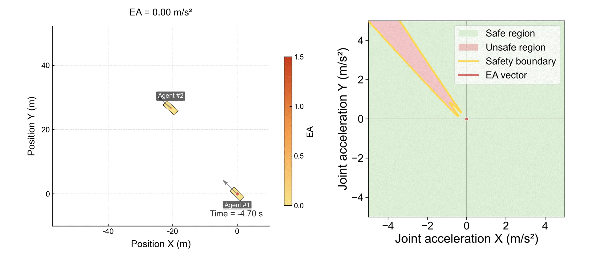
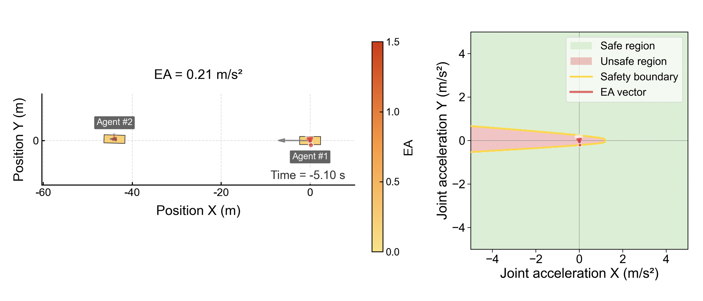

# Evasive Acceleration (EA)

A two-dimensional paradigm for instantaneous driving risk quantification.

---

## Visual overview

### Naturalistic interactions

<p align="center">
  
</p>

A representative merging interaction. In the EA visualizations, the **red arrow** is the EA vector in relative-acceleration space. Its **magnitude** is the EA value itself. A longer red arrow indicates that a larger instantaneous evasive effort is required to restore safety, and therefore indicates a higher instantaneous risk level.

<p align="center">
  
</p>

A representative urban interaction from the SinD dataset. Again, the **EA value equals the magnitude of the red arrow**. The longer the red arrow, the larger the required evasive acceleration, and the higher the risk.

### Reconstructed crash cases

<p align="center">
  
</p>

A reconstructed sideswipe crash case.

<p align="center">
  
</p>

A reconstructed rear-end crash case.

<p align="center">
  
</p>

A reconstructed T-bone crash case.

---

## Overview

Evasive Acceleration (EA) quantifies instantaneous driving risk as the minimum constant relative acceleration required to make a predicted interaction collision-free. Unlike time-to-collision (TTC)-based methods, EA evaluates risk in a two-dimensional relative-motion space rather than through one-dimensional temporal proximity alone.

This repository provides a research implementation of EA together with baseline risk metrics and practical utilities for both real-time and offline use.

The codebase supports two complementary usage modes:

1. **Single-frame computation**  
   Intended for real-time applications such as online risk monitoring, reinforcement learning, and closed-loop simulation, where the current state of two road users is given and the EA value of that single frame is needed immediately.

2. **Batch computation**  
   Intended for offline processing of multi-frame trajectory datasets stored in CSV files, where EA and baseline risk metrics are computed frame by frame over an entire interaction sequence.

---

## Why EA?

Most existing traffic risk metrics are based on the TTC paradigm. TTC-based methods quantify risk mainly through a single temporal dimension, even though real traffic interactions are inherently two-dimensional and directional.

This mismatch can lead to two common issues:

- interactions with substantially different avoidance difficulty may receive similar TTC-like values;
- risk may continue to appear to increase even after an effective evasive manoeuvre has already started to resolve the conflict.

EA addresses this limitation by quantifying the minimum instantaneous intervention required for collision avoidance in two-dimensional relative-acceleration space.

---

## Repository structure

```text
evasive-acceleration/
├── README.md
├── LICENSE
├── requirements.txt
├── assets/
│   └── gifs/
├── src/
│   ├── core_ea.py
│   ├── baseline_risk_metrics.py
│   ├── single_frame.py
│   └── batch_compute.py
├── demo_data/
│   └── ...
└── visualization/
    └── ...
```

### Main files

- `src/core_ea.py`  
  Core implementation of EA. This file contains the main numerical solver, the mode-specific EA computations, and the final EA aggregation.

- `src/baseline_risk_metrics.py`  
  Baseline and auxiliary risk metrics, such as TTC, TTC2D, ACT, DRAC, EI, InDepth, and MEI.

- `src/single_frame.py`  
  Lightweight single-frame interface for real-time use. This file wraps the core EA solver and allows users to compute EA directly from the current instantaneous states of two road users.

- `src/batch_compute.py`  
  Batch-processing script for CSV trajectory files. This file is intended for offline computation over full interaction sequences.

- `demo_data/`  
  Example CSV files for quick testing.

- `visualization/`  
  Visualization scripts for generating GIFs and related visual outputs.

---

## Installation

### 1. Clone the repository

```bash
git clone https://github.com/AutoChengh/evasive-acceleration.git
cd evasive-acceleration
```

### 2. Install dependencies

```bash
pip install -r requirements.txt
```

If `numba` is installed successfully, some computations may run faster. The implementation is designed to remain numerically consistent with or without `numba`.

---

## Usage

This repository supports two main workflows:

1. **Single-frame computation** for real-time or interactive use
2. **Batch computation** for offline CSV-based dataset processing

The recommended order for new users is:

1. start with the single-frame interface;
2. then run the batch computation on an example CSV file;
3. finally use the visualization scripts if needed.

---

## Required state input for each road user

EA takes the current instantaneous state of **two road users**. For **each** road user, the following **7 parameters** are required:

\[
(x,\; y,\; v,\; h,\; l,\; w,\; \omega)
\]

where:

- \(x\): global x position, in **m**
- \(y\): global y position, in **m**
- \(v\): speed magnitude, in **m/s**
- \(h\): heading angle, in **rad**
- \(l\): object length, in **m**
- \(w\): object width, in **m**
- \(\omega\): yaw rate, in **rad/s**

Therefore, a two-road-user interaction requires the following **14 scalar inputs** in total:

\[
(x_A,\; y_A,\; v_A,\; h_A,\; l_A,\; w_A,\; \omega_A,\;
x_B,\; y_B,\; v_B,\; h_B,\; l_B,\; w_B,\; \omega_B)
\]

### Practical note on yaw rate

Some trajectory datasets do not directly provide yaw rate. In that case, users can compute it from past heading values using a small finite-difference module. In practice, it is also advisable to apply a small amount of smoothing or filtering to reduce numerical jitter.

A practical guideline is:

- if **both** interacting road users do **not** exhibit obvious turning behaviour, setting `yawrate = 0` usually has little effect on the EA result;
- once one or both road users are involved in noticeable turning behaviour, it is recommended to provide a reasonably accurate yaw-rate input for EA computation.

### Applicability to vulnerable road users

The same interface can be used directly for **vulnerable road users (VRUs)** such as pedestrians and cyclists. The input format is unchanged; the main difference is simply that their physical dimensions (`length`, `width`) are smaller.

---

## 1. Single-frame computation

Use `src/single_frame.py` when the current instantaneous states of two road users are already known and the EA value for that single frame is needed immediately.

This is the recommended interface for:

- online risk monitoring
- reinforcement learning environments
- real-time simulation
- interactive analysis of one traffic scene

### Example

```python
from single_frame import (
    RoadUserState,
    SingleFrameEAConfig,
    compute_single_frame_ea,
    compute_single_frame_ea_result,
)

state_a = RoadUserState(
    x=0.0,
    y=0.0,
    v=10.0,
    heading=0.0,
    length=4.5,
    width=1.8,
    yaw_rate=0.0,
)

state_b = RoadUserState(
    x=20.0,
    y=0.0,
    v=8.0,
    heading=3.141592653589793,
    length=4.7,
    width=1.9,
    yaw_rate=0.0,
)

config = SingleFrameEAConfig()

ea = compute_single_frame_ea(state_a, state_b, config)
print("EA =", ea)
```

### Example with detailed output

```python
result = compute_single_frame_ea_result(state_a, state_b, config)

print("EA =", result.ea)
print("Elapsed time (s) =", result.elapsed_seconds)
print("Mode-specific values =", result.mode_dict)
```

### Returned quantities

The single-frame interface can provide:

- the final EA value;
- the four mode-specific EA values:
  - `EA_CTCT`
  - `EA_CTCV`
  - `EA_CVCT`
  - `EA_CVCV`
- runtime for the current call.

---

## 2. Batch computation

Use `src/batch_compute.py` when processing complete interaction sequences stored as CSV files.

This is the recommended workflow for:

- offline dataset analysis
- large-scale evaluation
- frame-by-frame processing of trajectory sequences
- generating result CSV files for later visualization or analysis

### Input data

Example input files are placed in:

```text
demo_data/
```

These CSV files should contain the state variables required by the batch-processing script. In general, each row corresponds to one frame of a two-road-user interaction and provides the quantities needed by the EA solver and the baseline metrics.

### Run the batch script

From the repository root:

```bash
python src/batch_compute.py
```

Depending on the current configuration of `batch_compute.py`, the script will typically:

1. read one or more CSV files from `demo_data/`;
2. compute EA and baseline risk metrics frame by frame;
3. write the processed results to output CSV files.

### Typical outputs

The batch script may write out quantities such as:

- final EA
- four mode-specific EA values
- TTC
- TTC2D
- ACT
- DRAC
- EI
- InDepth
- MEI
- other related geometric or kinematic quantities used by the implementation

Please check the current input path, output path, and file naming logic inside `src/batch_compute.py`, since these may be explicitly configured there.

---

## 3. Visualization

Visualization scripts are placed in:

```text
visualization/
```

These scripts are used to generate GIFs or other visual outputs from trajectory data and computed results.

Typical use cases include:

- visualizing road-user trajectories;
- visualizing risk evolution over time;
- generating GIFs for representative interaction cases.

Please refer to the corresponding script in `visualization/` for the expected input format and output location.

---

## Method summary

EA is computed from four motion-model combinations:

- `EA_CTCT`
- `EA_CTCV`
- `EA_CVCT`
- `EA_CVCV`

The final EA is defined as the arithmetic mean of these four mode-specific values.

In the current implementation:

- CTCT, CTCV, and CVCT are solved numerically;
- CVCV is solved analytically with prerequisite logic inherited from the current implementation.

This repository keeps the original research-oriented structure of the solver while exposing two practical interfaces:

- a **single-frame interface** in `single_frame.py`;
- a **batch-computation interface** in `batch_compute.py`.

---

## Library requirements

The codebase requires standard scientific Python libraries. The main dependencies are:

- `numpy`
- `pandas`
- `matplotlib`
- `Pillow`
- `numba` *(optional, for acceleration)*

Install them with:

```bash
pip install -r requirements.txt
```

If you prefer manual installation, a typical setup is:

```bash
pip install numpy pandas matplotlib pillow numba
```

---

## Notes

- `single_frame.py` is an interface layer. It does not duplicate the EA solver. The core EA logic remains in `core_ea.py`.
- `batch_compute.py` is the offline processing entry point for multi-frame CSV data.
- `baseline_risk_metrics.py` contains non-EA risk indicators and related supporting computations.
- For scenes without clear turning behaviour, `yawrate = 0` is usually acceptable.
- For scenes with clear turning behaviour, more accurate yaw-rate input is recommended.

---

## Citation

If you use this repository in academic work, please cite both the corresponding paper and the GitHub repository where appropriate.

### Suggested GitHub citation

**AutoChengh.** *evasive-acceleration*. GitHub repository.  
Available at: [https://github.com/AutoChengh/evasive-acceleration](https://github.com/AutoChengh/evasive-acceleration)

### BibTeX entry for the repository

```bibtex
@misc{autochengh_evasive_acceleration_github,
  author       = {AutoChengh},
  title        = {evasive-acceleration},
  year         = {2026},
  howpublished = {\url{https://github.com/AutoChengh/evasive-acceleration}},
  note         = {GitHub repository}
}
```

### Paper citation

If the corresponding paper is available, please also cite it using its official bibliographic information.

```bibtex
@article{your_ea_paper,
  title   = {Evasive Acceleration: A Two-Dimensional Paradigm for Instantaneous Driving Risk Quantification},
  author  = {...},
  journal = {...},
  year    = {...}
}
```

---

## License

This project is released under the license provided in `LICENSE`.
