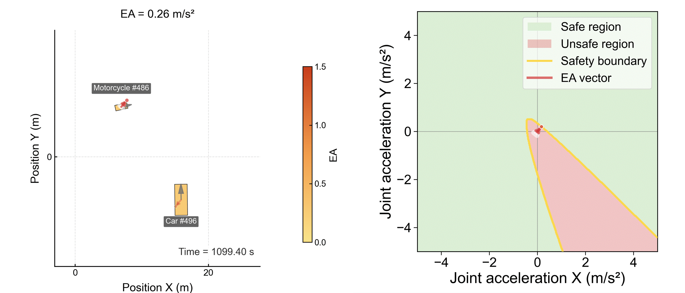
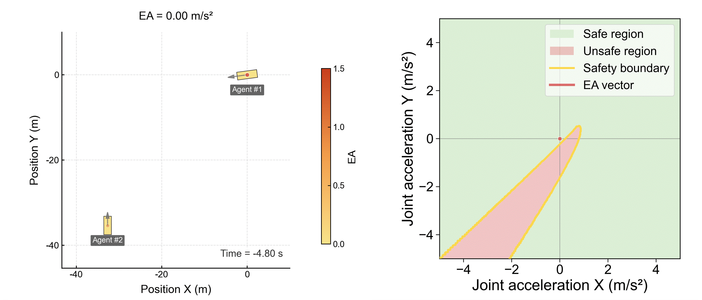

# Evasive Acceleration (EA)

A two-dimensional paradigm for instantaneous driving risk quantification.

**Paper:** [Driving risk emerges from the required two-dimensional joint evasive acceleration](https://arxiv.org/abs/2604.17841)

---

## Table of Contents
- [Visual Overview](#visual-overview)
- [Overview](#overview)
- [Why EA?](#why-ea)
- [Key Highlights](#key-highlights)
- [Installation \& Requirements](#installation--requirements)
- [Quick Start](#quick-start)
- [Repository Structure](#repository-structure)
- [Input Definition](#input-definition)
- [Usage](#usage)
  - [1. Single-Frame Computation](#1-single-frame-computation)
  - [2. Batch Computation](#2-batch-computation)
  - [3. Visualization](#3-visualization)
- [What the Code Computes](#what-the-code-computes)
- [Citation](#citation)
- [License](#license)

---

## Visual Overview

### Naturalistic Interactions
<p align="center">
  
</p>

A representative high-risk intersection interaction from the SinD dataset, involving one vehicle and one motorcycle.  
**The EA value is the magnitude of the red arrow shown in the visualization. A longer red arrow indicates a higher instantaneous risk level.**

### Reconstructed Crash Cases
<p align="center">
  
</p>

A reconstructed T-bone crash case from the CIMSS-TA database.  
**Again, the EA value equals the magnitude of the red arrow.**

---

## Overview

Evasive Acceleration (EA) is a **two-dimensional risk quantification paradigm** for traffic interactions. It quantifies instantaneous driving risk as the **minimum constant relative acceleration required to make the interaction collision-free** over a short future interval of interest.

Unlike time-to-collision (TTC) and most of its variants, EA does **not** quantify risk solely through one-dimensional temporal proximity. Instead, it evaluates risk directly in a **two-dimensional joint-motion space**, considering all possible directions of relative collision avoidance and retaining the least costly one.

This repository provides a practical implementation of EA for:
1. **Single-frame computation**, suitable for real-time risk monitoring, instant inspection, and reinforcement learning.
2. **Batch computation**, suitable for frame-wise processing of trajectory datasets and comparison against baseline risk metrics.
3. **Visualization**, for rendering interaction geometry and exporting GIFs for qualitative analysis.

---

## Why EA?

Across autonomous driving, TTC has long been the dominant benchmark for safety quantification. It shapes dataset curation, model training, testing pipelines, and even regulatory safety thinking. However, TTC fundamentally measures risk urgency through **only one temporal dimension**, whereas real traffic interactions are inherently **two-dimensional and multidirectional**.

This dimensionality mismatch leads to two major problems:

- **Limited risk informativeness**: scenes with substantially different avoidance difficulty can receive similar TTC-like values.
- **Risk-time misalignment**: risk may appear to keep increasing until the instant just before a conflict resolves, and then jump discontinuously, producing a distorted safety gradient.

EA addresses this by reframing risk as the **minimum instantaneous evasive cost required to restore safety**. It is defined in **relative motion space**, is **hyperparameter-free**, **physically interpretable**, and captures the continuous rise and dissipation of interaction risk more faithfully than TTC-style metrics.

---

## Key Highlights

- **A new risk quantification paradigm**  
  EA is not just another TTC variant. It introduces a genuinely two-dimensional formulation of interaction risk based on the minimum required joint evasive acceleration.

- **Physically interpretable and hyperparameter-free**  
  EA directly measures the least costly collision-avoiding intervention in relative motion space.

- **Validated at scale**  
  The paper evaluates EA on **44,180 naturalistic interactions** from **five open datasets across three countries**, together with **658 reconstructed real-world crashes**.

- **Earlier warnings under strict false-alarm budgets**  
  EA provides the earliest sustained warnings across all evaluated thresholds, with lead times up to **267% longer than TTC-based methods**.

- **Stronger crash-relevant information retention**  
  EA retains substantially more information about eventual crash outcomes than existing baselines, with improvements up to **241.4%**.

- **Strong nonredundant value beyond existing methods**  
  Adding EA to TTC-based methods yields an additional **12.4%–38.4%** of the information ceiling, whereas adding existing methods to EA contributes almost no extra information, resulting in asymmetry ratios up to **95.5×**.

- **Efficient enough for direct deployment**  
  The implemented computational framework achieves an average single-frame runtime of about **5 ms**, enabling large-scale and real-time use.

---

## Installation & Requirements

This repository is written in Python. Running it in a virtual environment is recommended.

### Core Libraries
The codebase requires:
- `numpy`
- `pandas`
- `matplotlib`
- `Pillow`

### Optional Acceleration
Installing `numba` is strongly recommended for faster computation. The code will still run without it, but execution speed will be reduced.

### Quick Install

```bash
pip install -r requirements.txt
```

If you do not want optional JIT acceleration, install only the core runtime
libraries:

```bash
pip install numpy pandas matplotlib pillow
```

---

## Quick Start

Run the built-in single-frame example:

```bash
python src/single_frame.py
```

Run batch computation on the default example data in `demo_data/`:

```bash
python src/batch_compute.py
```

By default, generated CSV files are written to `outputs/batch_results/`.

Run batch computation on your own CSV directory:

```bash
python src/batch_compute.py --input-dir path/to/your/csvs
```

Visualize the generated batch outputs:

```bash
python visualization/visualize_tracks_to_gif.py
```

By default, GIF files are written to `outputs/gifs/`.

---

## Repository Structure

```text
evasive-acceleration/
├── demo_data/                    # Example CSV data for quick batch testing
├── assets/gifs/                  # Pre-rendered qualitative examples for README
├── src/
│   ├── core_ea.py               # Core EA solver and motion-mode evaluations
│   ├── baseline_risk_metrics.py # Baseline metrics for comparison
│   ├── single_frame.py          # Entry script for instant single-frame evaluation
│   └── batch_compute.py         # Entry script for trajectory-level batch processing
├── visualization/               # Scripts for rendering cases and exporting GIFs
├── tests/                       # Lightweight smoke tests
└── requirements.txt             # Python dependencies
```

---

## Input Definition

EA is computed from the instantaneous states of **two interacting road users**. Each road user is represented by **7 parameters**.

### Required 7 Parameters
For road user `i ∈ {A, B}`, the input is:

`(x_i, y_i, v_i, h_i, L_i, W_i, ω_i)`

where:
- `x_i`: global x position `[m]`
- `y_i`: global y position `[m]`
- `v_i`: speed magnitude `[m/s]`
- `h_i`: heading angle `[rad]`
- `L_i`: body length `[m]`
- `W_i`: body width `[m]`
- `ω_i`: yaw rate `[rad/s]`

So one interaction frame consists of **14 values in total**.

**Command-line order:** `x y speed heading length width yaw_rate`

### Notes on Yaw Rate Input
Some trajectory datasets do not provide yaw rate directly. In that case, it can be estimated from the historical heading sequence using finite differences, ideally with light smoothing to suppress numerical jitter.

- If a road user does not exhibit noticeable turning behaviour, you may set `yaw_rate = 0`.
- If turning is evident, providing a more accurate yaw-rate estimate is strongly recommended.

### Applicability to Vulnerable Road Users (VRUs)
EA can also be applied to cyclists and pedestrians. The input format stays the same; only the geometric dimensions (`length` and `width`) need to be adapted to the corresponding road user.

### Required Batch CSV Columns

`src/batch_compute.py` expects one row per interaction frame and the following
columns:

| Agent A column | Agent B column | Unit |
|---|---|---|
| `Position X (m)` | `2_Position X (m)` | m |
| `Position Y (m)` | `2_Position Y (m)` | m |
| `Velocity (m/s)` | `2_Velocity (m/s)` | m/s |
| `Heading` | `2_Heading` | rad |
| `Length (m)` | `2_Length (m)` | m |
| `Width (m)` | `2_Width (m)` | m |
| `Yawrate` | `2_Yawrate` | rad/s |

Additional columns such as timestamps, IDs, accelerations, and labels are
preserved in the output CSV.

---

## Usage

### 1. Single-Frame Computation
Use `src/single_frame.py` for real-time EA evaluation, reinforcement learning, or instant inspection of a single interaction state.

**Run the built-in example:**
```bash
python src/single_frame.py
```

**Run with your own input:**
```bash
python src/single_frame.py \
  --agent-a 0 0 10 0 4.5 1.8 0 \
  --agent-b 20 0 8 3.1415926 4.7 1.9 0
```

Example interpretation:
- Agent A is at `(0, 0)` moving at `10 m/s`.
- Agent B is at `(20, 0)` moving at `8 m/s` in the opposite direction.

The terminal output reports the EA value for the current interaction state.

Expected output for the built-in example is approximately:

```text
EA = 4.828
Runtime = ...
```

### 2. Batch Computation
Use `src/batch_compute.py` to process trajectory cases frame by frame. This is suitable for dataset analysis and comparison between EA and baseline metrics.

**Run on the default example data:**
```bash
python src/batch_compute.py
```

**Run on your own CSV directory:**
```bash
python src/batch_compute.py --input-dir path/to/your/csvs
```

If no input directory is provided, the script uses `demo_data/` by default.

Generated CSV files are written to `outputs/batch_results/` by default, so the
input data remain unchanged. To choose another output directory:

```bash
python src/batch_compute.py --input-dir path/to/your/csvs --output-dir path/to/results
```

The batch script skips files ending in `_EA.csv` to avoid reprocessing its own
outputs.

### 3. Visualization
Use `visualization/visualize_tracks_to_gif.py` to render interaction geometry
and export GIFs after running batch computation.

Typical workflow:
1. Prepare the input CSV case.
2. Run `python src/batch_compute.py`.
3. Run `python visualization/visualize_tracks_to_gif.py`.
4. Inspect generated GIFs under `outputs/gifs/`.

Useful options:

```bash
python visualization/visualize_tracks_to_gif.py \
  --input-dir outputs/batch_results \
  --output-dir outputs/gifs \
  --frame-step 2 \
  --time-range 0.0 1.0 \
  --ea-max 1.5
```

Visualization is intentionally kept separate from the core solver, so users interested only in computation do not need the plotting workflow.

---

## What the Code Computes

### EA
The final EA value is computed as the arithmetic mean of four motion-mode-specific values:

- `EA_CTCT`
- `EA_CTCV`
- `EA_CVCT`
- `EA_CVCV`

These correspond to different short-horizon nominal motion assumptions for the two interacting road users. The final reported EA is their average, which improves robustness across heterogeneous interaction patterns.

The implementation exposes numerical search settings such as `T_total`,
`dt_coarse`, `dt_fine`, `a_max`, and direction-grid sizes. These control the
finite-horizon numerical solver and approximation accuracy; they are not
dataset-specific tuning parameters for the EA definition itself.

### Baseline Metrics
For comparison, the repository also includes several baseline risk metrics implemented in `baseline_risk_metrics.py`, including:

- `TTC`
- `TTC2D`
- `ACT`
- `DRAC`
- `MEI`

Batch outputs append the following columns:

| Column | Meaning |
|---|---|
| `EA_CVCV`, `EA_CVCT`, `EA_CTCV`, `EA_CTCT` | Mode-specific EA values |
| `EA` | Arithmetic mean of the four mode-specific EA values |
| `DRAC`, `TTC`, `TAdv`, `ACT`, `EI`, `MEI`, `TTC2D` | Baseline surrogate safety metrics |
| `v_closest`, `Shortest_D`, `InDepth`, `DTC`, `v_norm` | Intermediate baseline quantities |
| `BBox distance (m)`, `Centroid distance (m)` | Geometric distances |

For baseline metrics, invalid or non-conflicting cases follow the normalization
rules implemented in `baseline_risk_metrics.py`: some risk magnitudes are
reported as `0`, while time-to-event quantities may be reported as `inf`.

---

## Development Checks

Run the smoke tests with:

```bash
pip install pytest
pytest
```

The tests verify that the single-frame demo returns a finite EA and that the
batch pipeline writes the expected output columns for demo data.

---

## Citation

If you find this repository useful, please cite the paper:

```bibtex
@article{cheng2026driving,
  title={Driving risk emerges from the required two-dimensional joint evasive acceleration},
  author={Cheng, Hao and Jiang, Yanbo and Yu, Wenhao and Zhou, Rui and Bian, Jiang and Chen, Keyu and Liu, Zhiyuan and Huang, Heye and Zhang, Hailun and Zhang, Fang and Wang, Jianqiang and Zheng, Sifa},
  journal={arXiv preprint arXiv:2604.17841},
  year={2026},
  doi={10.48550/arXiv.2604.17841}
}
```

Plain-text citation:

> Cheng H, Jiang Y, Yu W, et al. Driving risk emerges from the required two-dimensional joint evasive acceleration[J]. arXiv preprint arXiv:2604.17841, 2026.

Paper link: https://arxiv.org/abs/2604.17841

---

## License

This project is released under the license provided in `LICENSE`.
